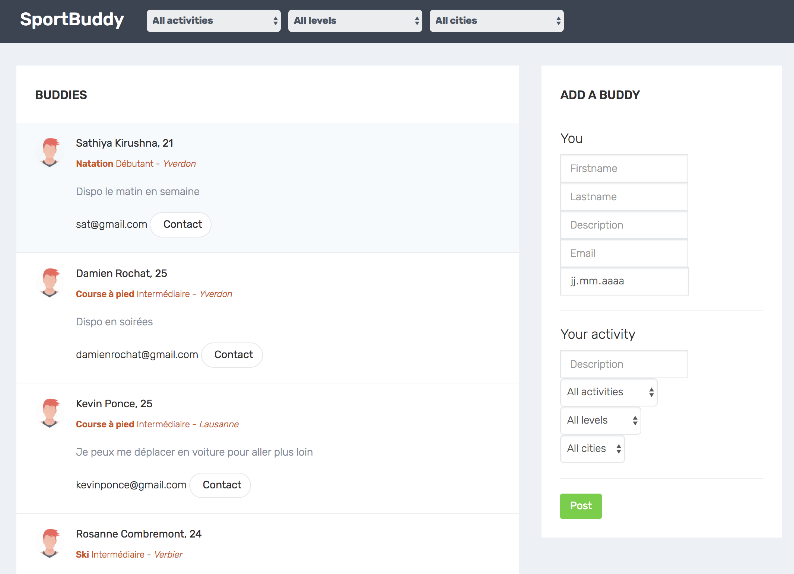
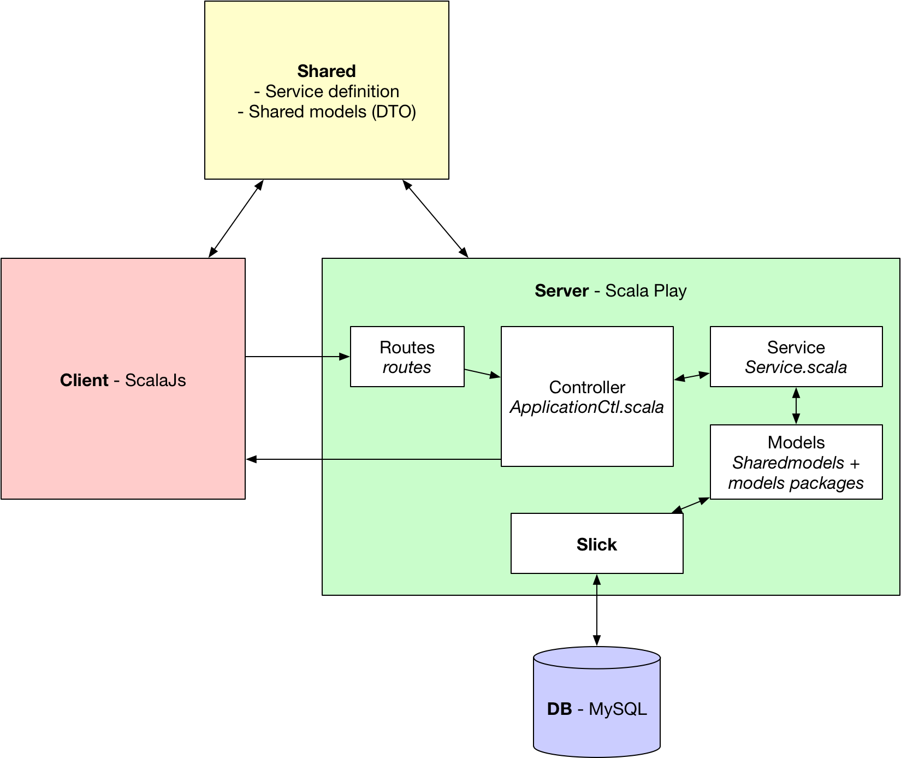
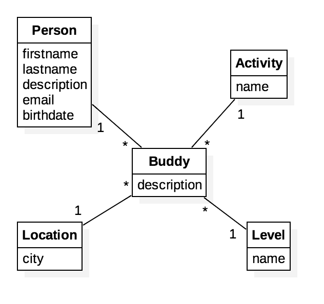

# Scala Project - Sportbuddy

*Heig-vd - 12.06.17*

Repo: https://github.com/sebastienrichoz/sportbuddy (*still under development*)

This project is a simple web application letting you find sport partners by specifying the activity, level and city you target.



## Technologies

- Scala PlayFramework 2.11.8
- ScalaJS 0.6.17
- Slick 3.2.0
- MySQL 5.7

Librairies used in client, server and shared are explicitly defined in `build.sbt`

## Run

This project need a database, you'll have to specify your connection settings in `server/conf/application.conf`.

### Tip : MySQL with Docker

Run a MySQL server: `docker run -p 3306:3306 -e MYSQL_ROOT_PASSWORD=root -e MYSQL_DATABASE=sportbuddy mysql:5`.

You can connect to the server with MySQL client: `docker run -it mysql:5 mysql -h 127.0.0.1` (host depending your Docker configuration).

### with Intellij (2017.1.4)
Clone this repo, open it with the IDE and execute the `server/run` config. Then browse at `localhost:9000`.

### with sbt (0.13.15)
Clone this repo, `cd sportbuddy`, open your terminal and execute `sbt` then `compile` and finally `server/run`. The app will be available at `localhost:9000`.

## Architecture

This section describes communications between entities, i.e. the client, the server and the database.

In addition to usual architectures, there is a `shared` folder containing an abstract service and shared models, that behave like DTOs.



### Communication

All communications between the client and the server use Autowire, a library that allow to simply call method on services from client to server instead of making XHR requests.

Our main service contains 5 methods :
- `getActivities()` returning all available activities
- `getLevels()` returning all available levels
- `getLocations()` returning all available locations
- `getBuddies(activity: String, level: String, location: String)` returning buddies (with optional filters)
- `addBuddy(...)` allowing to add a new person and directly a new buddy attached to it

In fact, there is a POST XHR request, handled by Autowire that.
It will call the right server method.

The application needs only two routes :
- The main route allowing to load the html page
- A `services` route that will be used by Autowire for communications

### Database

Data are stored in a MySQL Database. The database is created and populated - if not already existing - by the *Scala Play database evolutions* plugin when the server launches.

The `server/conf/evolutions/default/1.sql` contains the table creation and database population script. This file is automatically called by the plugin. Note that the package and file notation must match this specific syntax. For other scripts, we would have had a `2.sql`, `3.sql`, ... and for other databases `evolutions/anotherdbname/...`. These can be configured in `server/conf/evolutions/applicaion.conf`



On server side, we have to link our models to their corresponding database tables. Here it is shown with the Location table :

``` Scala
class LocationTableDef(tag: Tag) extends Table[Location](tag, "location") {

  def id = column[Int]("id", O.PrimaryKey, O.AutoInc)
  def city = column[String]("city")

  override def * =
    (id, city) <> (Location.tupled, Location.unapply)
}
```

### Application lifecycle

1. Server creation
2. Database creation and seeding with evolutions
3. Client first GET request to retrieve views and assets (in `server/public/`)
4. Client GET request to retrieve all activities, levels, cities and buddies
5. Client-Server communications depending of user interactions

The first client request is to get the views (html) and all assets (fonts, images, css, js). This is mandatory to have the structure and visual aspect of the app.

Then requests to get all buddies, activities, levels, and cities are executed to display these data on the client side. We insert the html content built with ScalaJs in the DOM by getting the specific html tag id, which is defined on server side. This method results in a high coupling between client and server.

Finally, the user searchs for buddies by choosing an appropriate activity, level, and/or city. These actions result in as many GET requests as the search button is clicked.

### Authors
[Sébastien Richoz](mailto:sebastien.richoz1@heig-vd.ch), [Damien Rochat](mailto:damien.rochat@heig-vd.ch)

### License
- HTML template : Ample Admin by wrappixel.com
- The rest of the project is under MIT license.
