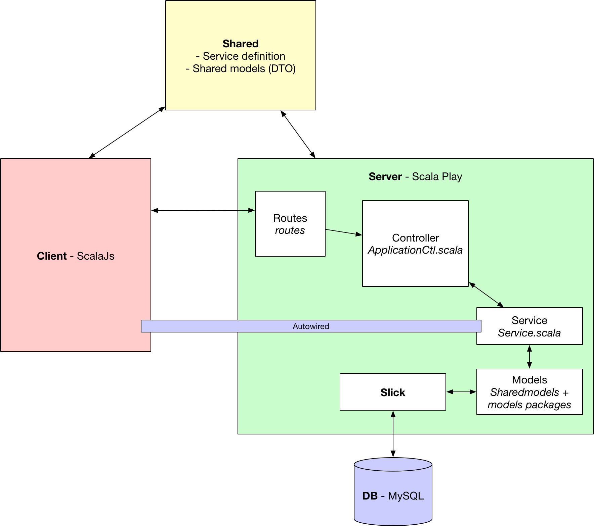

# SportBuddy
This project is a simple web application letting you find sport partners by specifying the activity, level and city you target.

TODO screenshot of webapp

**Project under development**

## Technologies

- Scala PlayFramework 2.11.8
- ScalaJS 0.6.17
- Slick 3.2.0
- MySQL 5.7

## Run

This is a local project using a local MySQL database, you'll have to specify your database connections settings in `server/conf/evolutions/applicaion.conf`.

### with Intellij (2017.1.4)
Clone this repo, open it with the IDE and execute the `server/run` config. Then browse at `localhost:9000`.

### with sbt (0.13.15)
Clone this repo, `cd sportbuddy`, open your terminal and execute `sbt` then `compile` and finally `server/run`. The app will be available at `localhost:9000`.

## Architecture

This section describes communications between entities, i.e. the client, the server and the database.

In addition to usual architectures, there is a `shared` folder containing an abstract service and shared models, that behave like DTOs.



### Database modelling
Data are stored in a MySQL Database. The database is created and populated - if not already existing - by the *Scala Play database evolutions* plugin when the server launches.

The `server/conf/evolutions/default/1.sql` contains the table creation and database population script. This file is automatically called by the plugin. Note that the package and file notation must match this specific syntax. For other scripts, we would have had a `2.sql`, `3.sql`, ... and for other databases `evolutions/anotherdbname/...`. These can be configured in `server/conf/evolutions/applicaion.conf`

TODO UML

In server side, we have to link our models to their correspondong database tables :

``` Scala

```

### Application lifecycle
1. Server creation
2. Database creation and seeding with evolutions
3. Client first GET request to retrieve views and assets (in `server/public/`)
4. Client GET request to retrieve all buddies, activities, levels, and cities
5. Client-Server communications depending of user interactions

The first client request is to get the views (html) and all assets (fonts, images, css, js). This is mandatory to have the structure and visual aspect of the app.

Then requests to get all buddies, activities, levels, and cities are executed to populate the app and display those data on the client side.

Finally, the user searchs for buddies by choosing an appropriate activity, level, and/or city. These actions result in as many GET requests as the search button is clicked.
### Authors
[Sébastien Richoz](mailto:sebastien.richoz1@heig-vd.ch), [Damien Rochat](mailto:damien.rochat@heig-vd.ch)

### License
- HTML template : Ample Admin by wrappixel.com
- The rest of the project is under MIT license.
